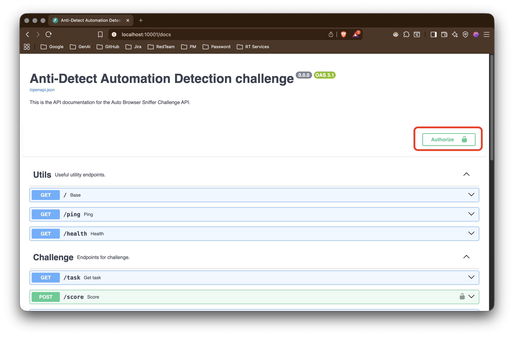

# Anti-Detect Automation Detection Testing Manual

This manual provides instructions for testing the ada_detection_v1 challenge using Docker.

## Overview

- Tests all detection  scripts' ability to detect automation frameworks
- Uses Docker for easy submission and testing

## Quick Start Guide

### Prerequisites

- Docker
- Docker Compose

### Step 1: Provide Your all Scripts

- Paste all of your scripts for detection into [detections](../src/templates/static/detections/) folder with matching names.

### Step 2: Prepare Setup

```bash
cp .env.example .env
cp ./templates/compose/compose.override.dev.yml ./compose.override.yml
```

### Step 3: Setting up environmental variables

- You need to set `AAD_CHALLENGE_NSTBROWSER_API_KEY` with real api key of [nstbrowser](https://www.nstbrowser.io/en/pricing), and you need to buy **professional** plan for testing this challenge. **Without `AAD_CHALLENGE_NSTBROWSER_API_KEY` challenge will not work.**

### Step 4: Start the Challenge Server

```bash
docker compose up -d 
```

### Step 4: Test Your Bot

- Visit <https://localhost:10001/docs>
- Authenticate using provided authentication method. You can find Api-Key from [Environmental variables](../.env) [By default it set to `challenge_api_key_here`]
    
- Test your detection files by running the `/score` endpoint
- if you see the warning log(like `Please visit endpoint <URI> to complete human verification for the task.`) then open given uri in log in your browser to complete human verification in your side.

## Important Notes

- The server runs on port 10001 by default
- Make sure port 10001 is available on your system
- Make sure your `nstbrowser` api key works and have **professional plan**.
- All interactions are logged for analysis. Miners can check logs by running `docker compose logs -f`
- All commands must be executed from challenge's root directory.

## Troubleshooting

If you encounter issues:

1. Check if Docker is running
2. Verify port 10001 is not in use
3. Check Docker logs using `docker compose logs`
4. Ensure you have proper permissions to run Docker commands
